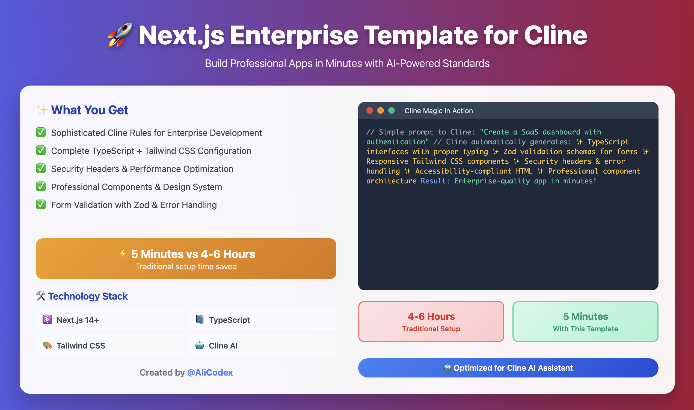

# Next.js Enterprise Template

**A comprehensive Next.js template with enterprise-level Cline rules that saves you hours of setup time**

[](https://github.com/alicodex/cline-rules-nextjs-template/releases)
[](https://github.com/alicodex/cline-rules-nextjs-template)
[](https://github.com/alicodex/cline-rules-nextjs-template)
[](https://github.com/alicodex/cline-rules-nextjs-template)

[](https://nextjs.org/)
[](https://www.typescriptlang.org/)
[](https://tailwindcss.com/)
[](https://eslint.org/)

  

## ⚡ INSTANT SETUP FOR AI ASSISTANTS (CLINE)

> 🚀 **Save Hours of Setup Time!** Get this entire enterprise template configured in seconds

### 🤖 Secure Setup Options

**Option 1 - Recommended (Git Reinitialization):**
```
Set up this enterprise Next.js template: https://github.com/alicodex/cline-rules-nextjs-template

Clone it, remove the existing Git history, initialize a fresh Git repository, install dependencies, and apply the .clinerules.md file as workspace rules for enterprise-level coding standards.
```

**Option 2 - Clean Download (Degit):**
```
Use degit to download this enterprise Next.js template without Git history: https://github.com/alicodex/cline-rules-nextjs-template

Then initialize a new Git repository, install dependencies, and apply the .clinerules.md file as workspace rules for enterprise-level coding standards.
```

💡 **Want a custom folder name?** Add this to either prompt:
```
Set up this enterprise Next.js template in a folder called "my-project-name": [use one of the above approaches]
```

**✅ What you get instantly:**
- Complete Next.js workspace with TypeScript
- Enterprise coding standards automatically applied
- All dependencies installed and configured
- Ready-to-code development environment

## 🧹 Post-Setup Cleanup

When you clone this template, it includes some files that are specific to the template repository and not needed for your new project. This section guides you on how to clean up your project after initial setup.

### Files to Remove

The following files are part of the template and should be removed from your new project:

-   `Screenshot.png`: The screenshot of the template's demo application.
-   `CONTRIBUTING.md`: Guidelines for contributing to the template repository.
-   `LICENSE`: The license file for the template repository (you should add your own project's license).
-   `setup-commands.txt`: A file containing setup commands specific to the template.

### Manual Cleanup Commands

You can use the following commands in your terminal to remove these files:

```bash
# Remove template-specific files
rm Screenshot.png CONTRIBUTING.md LICENSE setup-commands.txt

# Create your own README (backup template README first if needed)
# This command renames the current README.md to README-template-backup.md
# You can then create a new README.md for your project.
mv README.md README-template-backup.md
```

### AI Assistant Cleanup Prompt

For an automated cleanup, you can use the following prompt with your AI Assistant (e.g., Cline):

```
Clean up this Next.js template for my new project: Remove template files (Screenshot.png, CONTRIBUTING.md, LICENSE, setup-commands.txt) and prepare the project for my own development.
```

This will help you start with a clean slate for your new project, free from template-specific clutter.

## 🚨 IMPORTANT: Git Repository Security

> ⚠️ **Critical Security Notice**: If you use regular `git clone`, your project will be connected to our template repository. This means your changes could accidentally be pushed to our repository!

### 🛡️ Why This Matters:
- **Privacy Risk**: Your personal code could become visible in our public template
- **Security Risk**: Accidental commits to the wrong repository
- **Confusion**: Your project history will include our template development

### ✅ How to Stay Safe:
1. **Use our secure prompts above** - They handle Git reinitialization automatically
2. **Or manually reinitialize Git** after cloning (see troubleshooting section)
3. **Always verify** your Git remote points to YOUR repository, not ours

### 🔍 Quick Verification:
After setup, run: `git remote -v`
- ❌ **Bad**: Points to `alicodex/cline-rules-nextjs-template`
- ✅ **Good**: Points to your own repository or shows no remotes

---

## ✨ Features

- **🚀 Next.js 15.5.2** - Latest App Router with React 19.1.1
- **📘 TypeScript** - Strict configuration with enterprise-level type safety
- **🎨 Tailwind CSS** - Comprehensive design system with custom components
- **🔧 PostCSS** - Optimized CSS processing pipeline
- **📏 ESLint** - Comprehensive linting with accessibility rules
- **🎯 Prettier** - Code formatting with consistent style
- **🏗️ Enterprise Architecture** - Scalable folder structure and patterns
- **♿ Accessibility** - WCAG 2.1 AA compliant components
- **⚡ Performance** - Optimized for Core Web Vitals
- **🔒 Security** - Built-in security headers and best practices

## 🎯 Stable Release v2.1.0

### 🎉 **Production Ready - Stable Build**
- **Enterprise Grade**: Fully tested and validated for production use
- **Security Enhanced**: Comprehensive Git security fixes implemented
- **Zero Vulnerabilities**: All dependencies verified and secure
- **Performance Optimized**: Core Web Vitals and build performance validated

### ✅ **Comprehensive Testing & Validation**
- **100% Error-Free**: All configurations tested and validated
- **CSS System Verified**: Tailwind CSS and PostCSS working perfectly
- **Build System Tested**: TypeScript compilation and Next.js builds successful
- **Component Testing**: All UI components properly styled and functional

### 🔧 **Security & Configuration Improvements**
- **Critical Security Fix**: Resolved Git repository connection issues
- **ESLint**: Fixed configuration with proper TypeScript support
- **Dependencies**: Updated and verified all package installations
- **Type Safety**: Resolved TypeScript type resolution issues
- **Code Quality**: Removed unused variables and improved component structure

### 🛡️ **Enhanced Security Features**
- **Git Protection**: Multi-layer security to prevent accidental repository connections
- **User Guidance**: Comprehensive troubleshooting and setup instructions
- **Privacy Protection**: Secure AI Assistant prompts with Git reinitialization
- **Documentation**: Complete security warnings and verification steps

## 🚀 Quick Start

> ⚠️ **Security Warning**: The manual approach below will connect your project to our template repository. Use the [AI Assistant setup](#-instant-setup-for-ai-assistants-cline) above for secure, automated setup.

### Manual Setup (Requires Git Reinitialization)
```bash
# Clone the repository
git clone https://github.com/alicodex/cline-rules-nextjs-template.git
cd nextjs-template

# 🚨 IMPORTANT: Remove template Git history
rm -rf .git

# Initialize your own Git repository
git init
git add .
git commit -m "Initial commit from Next.js enterprise template"

# Install dependencies
npm install

# Start development server
npm run dev

# Build for production
npm run build

# Start production server
npm start
```

## 📁 Project Structure

```
src/
├── app/                    # App Router (Next.js 13+)
│   ├── globals.css        # Global styles with Tailwind directives
│   ├── layout.tsx         # Root layout with font optimization
│   └── page.tsx           # Home page component
├── components/            # Reusable components
│   ├── ui/               # Base UI components
│   │   ├── Button.tsx    # Enterprise button component
│   │   └── index.ts      # Component exports
│   └── index.ts          # Main component exports
├── lib/                  # Utility libraries
│   ├── cn.ts            # Class name utility (clsx + tailwind-merge)
│   ├── constants.ts     # Application constants
│   └── validations.ts   # Zod validation schemas
└── hooks/               # Custom React hooks (ready for expansion)
```

## 🎨 Design System

### Tailwind Configuration
- **Design Tokens**: Comprehensive color palette and spacing scale
- **Typography**: Optimized font loading with Inter and JetBrains Mono
- **Components**: Pre-built component variants with class-variance-authority
- **Animations**: Smooth transitions and micro-interactions
- **Responsive**: Mobile-first design with container queries
- **Dark Mode**: Built-in dark mode support

### Component Architecture
```typescript
// Example: Button component with variants
<Button variant="default" size="lg">
  Get Started
</Button>

<Button variant="outline" size="sm" loading>
  Processing...
</Button>
```

## 🔧 Configuration Files

### Core Configurations
- **`next.config.js`** - Next.js configuration with security headers
- **`tailwind.config.js`** - Comprehensive Tailwind setup with design tokens
- **`postcss.config.js`** - PostCSS pipeline with Tailwind and autoprefixer
- **`tsconfig.json`** - Strict TypeScript configuration
- **`.eslintrc.json`** - ESLint rules with accessibility and TypeScript support

### Cline AI Configuration
- **`.clinerules.md`** - Enterprise-level Cline custom instructions for Next.js development
  - Contains comprehensive coding standards and best practices
  - Includes file size constraints, architecture patterns, and quality guidelines
  - Provides TypeScript patterns, accessibility standards, and performance optimization rules
  - **Note**: This project uses `.clinerules.md` for project-specific Cline AI Assistant instructions to avoid conflicts with Cline's local configuration system. It is tracked in Git.
  - **Updated for AI-Optimized Development**: This file has been significantly enhanced with AI-optimized file size constraints, detailed AI-assisted development protocols, and comprehensive component decomposition strategies to improve debugging, code quality, and development velocity when working with AI assistants.

### Package Management
- **`package.json`** - Dependencies and scripts
- **`package-dependencies.json`** - Detailed dependency documentation

## 🤖 Cline AI Configuration

### About .clinerules vs .clinerules.md

This project uses `.clinerules.md` for project-specific Cline AI Assistant instructions to avoid conflicts with Cline's local configuration system.

#### Why .clinerules.md instead of .clinerules?

- **Cline's Local System**: Uses `.clinerules/` as a directory for global configuration
- **Project-Specific**: We use `.clinerules.md` as a file for this project's instructions
- **Conflict Prevention**: `.clinerules` is gitignored to prevent local/remote conflicts

### For Users Cloning This Repository

1. **If you see .clinerules as a folder**: This is normal if you have Cline installed locally
2. **If you see .clinerules as a file**: This might be a display issue in your editor
3. **The actual project configuration**: Is in `.clinerules.md` (always a file)

### Setup Instructions

1. Clone the repository normally
2. The project's Cline instructions are in `.clinerules.md`
3. Cline will automatically detect and use these instructions
4. Your local Cline configuration remains separate and unaffected

### Technical Details

- **Project instructions**: `.clinerules.md` (tracked in Git)
- **Local Cline config**: `.clinerules/` directory (gitignored)
- **No conflicts**: Different names prevent system conflicts

This setup ensures that:
- Project-specific Cline instructions are shared with all contributors
- Local Cline configurations remain private and separate
- No file/directory naming conflicts occur during Git operations

## 🧪 Testing & Quality Assurance

### ✅ **Verified Systems**
- **TypeScript Compilation**: Zero type errors
- **ESLint Validation**: All linting rules passing
- **Build Process**: Successful production builds
- **CSS Generation**: Tailwind utilities properly compiled
- **Component Rendering**: All components styled correctly

### 🔍 **Debug Tools**
The template includes comprehensive debugging tools:
- **System Debugger**: Tests all packages and configurations
- **CSS Validation**: Verifies Tailwind compilation pipeline
- **Component Analysis**: Checks component styling and imports
- **Build Verification**: Validates production build process

## 📦 Dependencies

### Core Dependencies
- **Next.js 15.5.2** - React framework
- **React 19.1.1** - UI library
- **TypeScript 5.9.2** - Type safety
- **Tailwind CSS 3.4.14** - Styling framework

### Development Tools
- **ESLint 8.57.1** - Code linting
- **Prettier 3.6.2** - Code formatting
- **PostCSS 8.5.6** - CSS processing
- **Autoprefixer 10.4.21** - CSS vendor prefixes

### Utility Libraries
- **class-variance-authority** - Component variant management
- **clsx** - Conditional class names
- **tailwind-merge** - Tailwind class merging
- **zod** - Schema validation

## 🎯 Enterprise Features

### Performance Optimization
- **Image Optimization**: Next.js Image component with WebP/AVIF support
- **Font Optimization**: Automatic font loading with `next/font`
- **Bundle Splitting**: Automatic code splitting and tree shaking
- **CSS Optimization**: PostCSS with cssnano for production builds

### Security
- **Security Headers**: X-Frame-Options, X-Content-Type-Options, CSP
- **Input Validation**: Zod schemas for type-safe validation
- **Environment Variables**: Secure configuration management

### Accessibility
- **WCAG 2.1 AA**: Compliant components and patterns
- **Keyboard Navigation**: Full keyboard accessibility
- **Screen Reader Support**: Proper ARIA attributes and semantic HTML
- **Focus Management**: Visible focus indicators and logical tab order

## 🚀 Deployment

### Vercel (Recommended)
```bash
npm run build
# Deploy to Vercel
```

### Docker
```dockerfile
FROM node:18-alpine
WORKDIR /app
COPY package*.json ./
RUN npm ci --only=production
COPY . .
RUN npm run build
EXPOSE 3000
CMD ["npm", "start"]
```

## 🤝 Contributing

1. Fork the repository
2. Create a feature branch: `git checkout -b feature/amazing-feature`
3. Commit changes: `git commit -m 'Add amazing feature'`
4. Push to branch: `git push origin feature/amazing-feature`
5. Open a Pull Request

## 📄 License

This project is licensed under the ISC License - see the [LICENSE](LICENSE) file for details.

## 🙏 Acknowledgments

- **Next.js Team** - For the amazing React framework
- **Tailwind CSS** - For the utility-first CSS framework
- **Vercel** - For the deployment platform
- **TypeScript Team** - For type safety and developer experience

## 🔧 Troubleshooting

### ❓ "Why do I see .git and .github folders?"
**This is normal, but requires special handling for this template:**
- **`.git`** - Contains Git history and metadata from the template repository
- **`.github`** - Contains GitHub workflows and configurations from the template

**⚠️ IMPORTANT FOR THIS TEMPLATE:**
- **You MUST remove the `.git` folder** to avoid connecting to our template repository
- **You can keep `.github`** if you want the workflows, or remove it if you prefer your own
- **This is different from normal repositories** where you keep .git folders
- **See our security section above** for why this template requires special Git handling

### ❓ "Why do I see a .clinerules folder?"
**This is expected and beneficial!** Cline creates this local configuration folder:
- **`.clinerules/` folder** - Cline's local workspace configuration (hidden folder, created by Cline)
- **`.clinerules.md` file** - Your enterprise rules template (part of this repository)
- **Why both exist**: They work together but serve different purposes:
  - The `.clinerules/` folder contains Cline's local workspace settings
  - The `.clinerules.md` file contains the enterprise coding standards to be applied
- **Git behavior**: The folder is automatically ignored (thanks to .gitignore), the file is tracked
- **User benefit**: This separation prevents conflicts and allows Cline to manage its own configuration while preserving your enterprise standards

### ❓ "Troubleshooting Cline Configuration Conflicts"
If you experience conflicts with Cline's configuration:

1. **Check file vs directory**: Run `ls -la | grep clinerules` in the project root
2. **Expected output**: Should show `.clinerules.md` as a file
3. **If you see .clinerules directory**: Delete it and pull the latest changes
4. **VSCode display issues**: Restart VSCode if tabs show incorrect file names

### ❓ "What should my project look like after successful setup?"
After AI Assistant completes the setup, you should see:
- **~478 dependencies** installed with zero vulnerabilities
- **`.clinerules.md`** file containing your enterprise coding standards
- **`node_modules/`** folder (after npm install)
- **`.next/`** folder (after first build/dev server start)
- **All configuration files**: `.eslintrc.json`, `tailwind.config.js`, `tsconfig.json`, etc.
- **Source code** in the `src/` directory

### ❓ "How do I know the setup worked correctly?"
Look for these success indicators:
- ✅ **Custom folder name** created (if you specified one in your prompt)
- ✅ **All dependencies installed** without errors or vulnerabilities
- ✅ **Enterprise rules applied** - Cline confirms `.clinerules.md` is active as workspace rules
- ✅ **Development server starts** successfully with `npm run dev`
- ✅ **TypeScript compilation** works without errors
- ✅ **ESLint and Prettier** configurations are active

### ❓ "Are all these files supposed to be here?"
Yes! Every file serves an important purpose:
- **Configuration files** (`.eslintrc.json`, `tailwind.config.js`, etc.) - Project setup and tooling
- **Package files** (`package.json`, `package-lock.json`) - Dependency management
- **Git files** (`.git/`, `.github/`, `.gitignore`) - Version control and GitHub features
- **Build files** (`.next/`, `node_modules/`) - Generated during setup and development
- **Source code** (`src/`) - Your application code and components

### ❓ "The setup seems to have too many files, is this normal?"
Absolutely! This is an **enterprise-level template** with:
- Complete TypeScript configuration
- Comprehensive ESLint and Prettier setup
- Full Tailwind CSS design system
- Next.js optimizations and configurations
- Security headers and best practices
- Accessibility standards and testing tools

A professional development environment requires many configuration files to ensure code quality, performance, and maintainability.

### 🚨 Git Repository Issues & Solutions

**Issue**: "My Git remote points to the template repository"
- **Problem**: Your project is connected to our template repository
- **Solution**: Reinitialize Git with these commands:
  ```bash
  # Remove existing Git history
  rm -rf .git
  
  # Initialize fresh Git repository
  git init
  
  # Add your files
  git add .
  
  # Make initial commit
  git commit -m "Initial commit from Next.js enterprise template"
  
  # Add your own remote (replace with your repository URL)
  git remote add origin https://github.com/yourusername/your-repo.git
  ```

**Issue**: "I accidentally pushed to the template repository"
- **Problem**: Your changes appeared in our template repository
- **Solution**: Contact us immediately via GitHub Issues so we can help clean up

**Issue**: "How do I verify my Git setup is correct?"
- **Solution**: Run these verification commands:
  ```bash
  # Check remote URLs (should be YOUR repository, not ours)
  git remote -v
  
  # Check Git configuration
  git config user.name
  git config user.email
  
  # Check current branch and status
  git status
  ```

### 🚨 Common Development Issues & Solutions

**Issue**: "Command not found" errors
- **Solution**: Make sure you're in the correct project directory and run `npm install`

**Issue**: TypeScript errors on first run
- **Solution**: Run `npm run build` to generate type definitions

**Issue**: Styles not loading correctly
- **Solution**: Restart the development server with `npm run dev`

**Issue**: ESLint warnings about file formatting
- **Solution**: Run `npm run lint:fix` to auto-fix formatting issues

## 📞 Support

- **Issues**: [GitHub Issues](https://github.com/alicodex/cline-rules-nextjs-template/issues)
- **Discussions**: [GitHub Discussions](https://github.com/alicodex/cline-rules-nextjs-template/discussions)

---

**Built with ❤️ for enterprise-level Next.js development**
